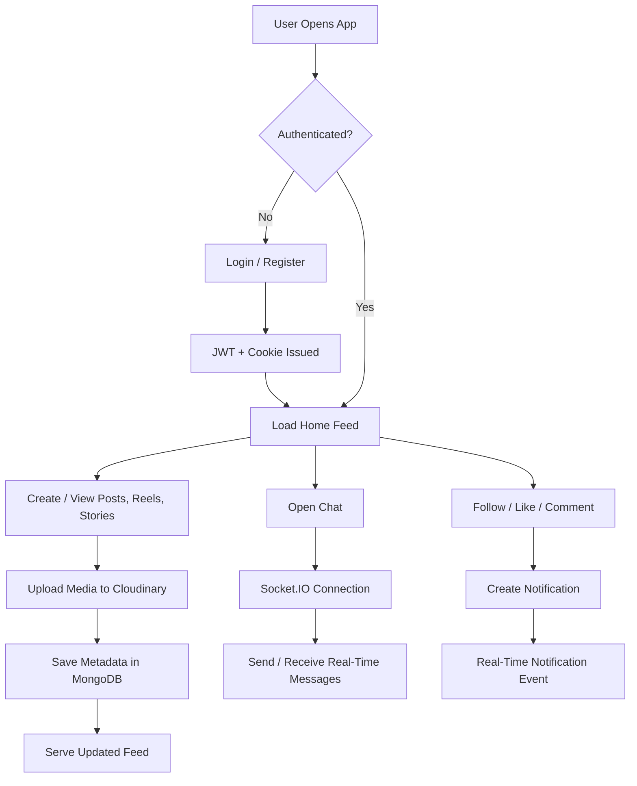
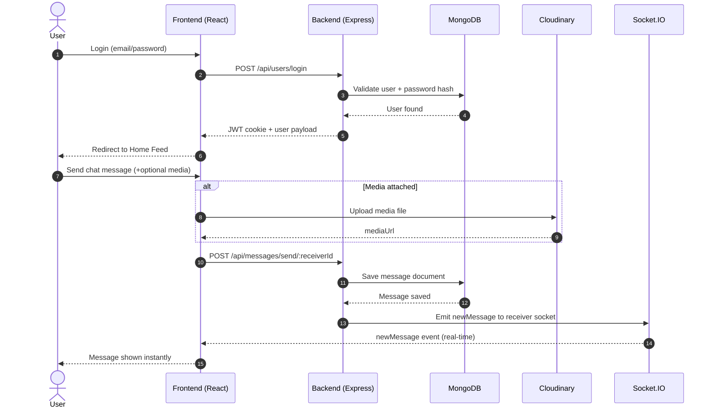

<div align="center">

<h1>🎬 SeeMedia</h1>

<p><b>A full-stack social media platform — posts, reels, stories, real-time chat, and more.</b></p>

[](https://see-media.vercel.app)
[](https://seemedia.onrender.com)
[](https://github.com/yash9359/SeeMedia)


</div>

---

## 📸 Screenshots

<div align="center">
  
  <br/><br/>
  
</div>

---

## ✨ Features

| Feature | Description |
|---|---|
| 🔐 Auth | Register, login, logout with JWT + cookie-based auth |
| 👤 Profile | Edit profile, upload profile image via Cloudinary |
| 📸 Posts | Create, delete, like, comment, save/unsave posts |
| 🎬 Reels | Short video reels with likes and comments |
| 📖 Stories | 24h auto-expiry stories with viewers, likes, comments |
| 👥 Social | Follow/unfollow users, suggested users, explore feed |
| 💬 Chat | Real-time 1:1 messaging with text + image/video |
| 🔔 Notifications | Live follow/like notifications via Socket.IO |
| 🌐 Online Status | Real-time online users list |

---

## 🏗️ Architecture

```
Frontend (React + Vite)          Backend (Express + Node.js)
┌─────────────────────┐          ┌──────────────────────────┐
│  Redux Toolkit      │◄────────►│  REST API Routes         │
│  React Router       │  Axios   │  JWT + Cookie Auth       │
│  Tailwind CSS v4    │          │  Mongoose Models         │
│  Socket.IO Client   │◄────────►│  Socket.IO Server        │
│  Framer Motion      │ WS conn  │  Cloudinary Uploads      │
└─────────────────────┘          └──────────┬───────────────┘
                                             │
                                   ┌─────────▼──────────┐
                                   │     MongoDB        │
                                   │  Users, Posts,     │
                                   │  Reels, Stories,   │
                                   │  Messages          │
                                   └────────────────────┘
```

---

## 🔄 App Flow



---

## 🔐 Auth + Chat Flow



---

## 🗂️ Project Structure

```
SeeMedia/
├── backend/
│   ├── index.js
│   ├── config/           # Cloudinary & DB config
│   ├── controllers/      # Route logic
│   ├── db/               # MongoDB connection
│   ├── middleware/        # Auth & upload middleware
│   ├── models/           # Mongoose schemas
│   ├── routes/           # API routes
│   └── socket/           # Socket.IO logic
└── frontend/
    └── src/
        ├── components/   # Reusable UI components
        ├── pages/        # Route-level pages
        ├── redux/        # Store, slices, actions
        └── lib/          # Axios instance, utils
```

---

## 📡 API Reference

<details>
<summary><b>👤 User Routes</b></summary>

| Method | Endpoint | Description |
|---|---|---|
| POST | `/users/register` | Register new user |
| POST | `/users/login` | Login |
| GET | `/users/logout` | Logout |
| GET | `/users/profile` | Get own profile |
| GET | `/users/suggested/users` | Suggested users |
| GET | `/users/:id` | Get user by ID |
| POST | `/users/follow/:targetId` | Follow user |
| POST | `/users/unfollow/:targetId` | Unfollow user |
| GET | `/users/:id/followers` | Get followers |
| GET | `/users/:id/followings` | Get following |
| POST | `/users/upload-profile` | Upload profile image |
| PUT | `/users/update-profile` | Update profile |

</details>

<details>
<summary><b>📸 Post Routes</b></summary>

| Method | Endpoint | Description |
|---|---|---|
| POST | `/posts/create` | Create post |
| GET | `/posts/all` | Get all posts |
| GET | `/posts/:id` | Get post by ID |
| DELETE | `/posts/:id` | Delete post |
| PUT | `/posts/:id/like` | Like/unlike post |
| POST | `/posts/:id/comment` | Comment on post |
| PUT | `/posts/:postId/save` | Save/unsave post |

</details>

<details>
<summary><b>🎬 Reel Routes</b></summary>

| Method | Endpoint | Description |
|---|---|---|
| POST | `/reels/create` | Create reel |
| GET | `/reels/all` | Get all reels |
| GET | `/reels/:id` | Get reel by ID |
| DELETE | `/reels/:id` | Delete reel |
| PUT | `/reels/:id/like` | Like/unlike reel |
| POST | `/reels/:id/comment` | Comment on reel |

</details>

<details>
<summary><b>📖 Story Routes</b></summary>

| Method | Endpoint | Description |
|---|---|---|
| POST | `/stories/create` | Create story |
| GET | `/stories/all` | Get all stories |
| PUT | `/stories/:id/view` | Mark as viewed |
| DELETE | `/stories/:id` | Delete story |
| PUT | `/stories/:id/like` | Like story |
| POST | `/stories/:id/comment` | Comment on story |

</details>

<details>
<summary><b>💬 Message Routes</b></summary>

| Method | Endpoint | Description |
|---|---|---|
| GET | `/messages/users` | Get chat users |
| GET | `/messages/:receiverId` | Get conversation |
| POST | `/messages/send/:receiverId` | Send message |

</details>

---

## ⚡ Socket Events

| Direction | Event | Description |
|---|---|---|
| Server → Client | `getOnlineUsers` | List of currently online users |
| Server → Client | `newMessage` | Real-time incoming message |
| Server → Client | `notification` | Live follow/like notification |

> Socket connects with `query: { userId }` on client init.

---

## ⚙️ Environment Variables

**`backend/.env`**
```env
PORT=
MONGODB_URL=
JWT_SECRET=
CLIENT_URL=
NODE_ENV=
CLOUDINARY_CLOUD_NAME=
CLOUDINARY_API_KEY=
CLOUDINARY_API_SECRET=
```

**`frontend/.env`**
```env
VITE_API_BASE_URL=
VITE_BACKEND_URL=
```

---

## 🚀 Local Setup

```bash
# 1. Clone the repo
git clone https://github.com/yash9359/SeeMedia.git
cd SeeMedia

# 2. Start backend
cd backend
npm install
npm run dev
# Runs on http://localhost:8000

# 3. Start frontend
cd ../frontend
npm install
npm run dev
# Runs on http://localhost:5173
```

---

## 🔮 Roadmap

- [ ] Chat typing indicator & read receipts
- [ ] Infinite scroll / pagination
- [ ] Search users and posts by keywords
- [ ] Notification history & persistence
- [ ] Dark / light mode toggle

---

## 📄 License

Open source — free to use for learning and personal projects.

---

<div align="center">
  <b>Built with ❤️ by <a href="https://github.com/yash9359">Yash Gupta</a></b>
</div>
